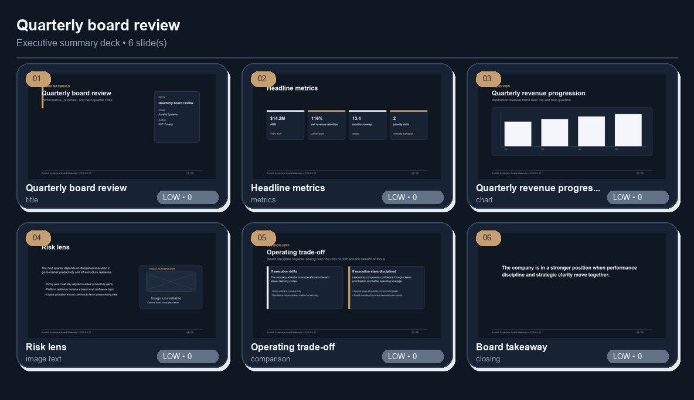

# PPT Creator

> **A professional JSON-to-PPTX engine for executive-grade presentations, with CLI, HTTP API, interactive playground, QA review, preview pipelines, visual regression, and an optional AI briefing layer.**

PPT Creator is not a throwaway slide script.

It is a structured presentation platform built to turn validated JSON payloads into polished `.pptx` decks with a consistent design system, operational tooling, and production-friendly workflows for review, preview, and artifact comparison.

At a glance, the project already includes:

- a **core renderer** for structured executive presentations
- a **CLI** for rendering, validation, review, preview, baseline management, templates, and workflow bootstrapping
- a **standard-library HTTP API** for local integration
- an **interactive playground** for editing, QA, and artifact inspection
- a **preview and visual regression pipeline** with synthetic and Office-backed modes
- an **optional AI layer** for turning briefings into structured presentation JSON

---

## Why PPT Creator exists

Most presentation automation tools fall into one of two extremes:

- they generate slides but give you very little control over structure and quality
- or they are technically flexible, but too low-level and brittle for repeatable business use

PPT Creator is designed to sit in the middle:

1. **Structured input** keeps the content explicit and automatable
2. **A reusable theme and layout system** keeps the output visually consistent
3. **QA, preview, and regression workflows** keep the artifacts reviewable and operationally safe
4. **Optional AI generation** helps produce draft JSON without coupling the renderer to a model runtime

The result is a platform that can be read as both:

- a serious **presentation engine**
- and a credible **engineering portfolio project**

---

## What the project does

PPT Creator can:

- render structured JSON into `.pptx`
- validate payloads before rendering
- review decks heuristically for density, overflow, balance, and layout pressure
- generate slide previews as PNGs
- render previews from the final `.pptx` artifact when Office-backed tooling is available
- compare preview sets and rendered PPTX artifacts visually
- promote preview baselines for regression workflows
- bootstrap starter decks from domains, audience profiles, workflows, and brand packs
- expose themes, layouts, workflows, brand packs, assets, and profiles through a lightweight marketplace catalog
- optionally generate deck JSON from structured or semi-structured briefings via `ppt_creator_ai`

---

## Feature highlights

### Core presentation engine

- JSON-first presentation contract
- reusable layout renderers per slide type
- theme tokens and semantic layout anchors
- branding overrides and brand pack support
- structured speaker notes support on every slide

### Operational tooling

- CLI for day-to-day deck operations
- local HTTP API for integration into other systems
- browser-based playground for editing and inspection
- Makefile targets for common development and release tasks

### Preview and QA

- synthetic preview rendering
- Office-backed preview rendering from real `.pptx`
- thumbnail sheets and preview manifests
- heuristic QA review with risk summaries and top-risk slide signals
- baseline promotion and visual regression workflows
- direct review and comparison of rendered PPTX artifacts

### Optional AI layer

- heuristic generation with no real LLM dependency
- `local_service` provider for delegating runtime execution to an external local AI service
- `ollama_local` provider for direct local authoring/debugging
- provider benchmarking, repair-loop handling, and iterative refinement paths

---

## Architecture overview

```text
                   PPT Creator

        ┌────────────────────────────────────┐
        │ Structured JSON / Briefing Input   │
        └────────────────────────────────────┘
                          │
                          ▼
        ┌────────────────────────────────────┐
        │ Schema + template / workflow layer │
        │ pydantic contracts, templates,     │
        │ profiles, workflows, brand packs   │
        └────────────────────────────────────┘
                          │
                          ▼
        ┌────────────────────────────────────┐
        │ Theme + layout engine              │
        │ tokens, semantic anchors, slide    │
        │ renderers, composition helpers     │
        └────────────────────────────────────┘
                          │
                          ▼
        ┌────────────────────────────────────┐
        │ Artifact operations                │
        │ render, preview, review, compare,  │
        │ baseline promotion, reports        │
        └────────────────────────────────────┘
                          │
          ┌───────────────┼────────────────┐
          │               │                │
          ▼               ▼                ▼
   CLI surface      HTTP API         Playground UI
                          │
                          ▼
        ┌────────────────────────────────────┐
        │ Optional AI generation layer       │
        │ heuristic / local_service /        │
        │ ollama_local                       │
        └────────────────────────────────────┘
```

### Core modules

- `ppt_creator/schema.py` — input contracts and validation
- `ppt_creator/theme.py` — theme tokens, color system, semantic layout tokens, theme catalog
- `ppt_creator/renderer.py` — core PPTX renderer and composition utilities
- `ppt_creator/layouts/` — isolated rendering logic per slide type
- `ppt_creator/preview.py` — preview, artifact comparison, and baseline operations
- `ppt_creator/qa.py` — heuristic review and layout pressure analysis
- `ppt_creator/templates.py` — starter deck generation by domain
- `ppt_creator/workflows.py` — workflow presets and workflow packets
- `ppt_creator/catalog.py` — lightweight internal marketplace/catalog output
- `ppt_creator/api.py` — local HTTP API and playground
- `ppt_creator_ai/` — optional AI briefing-to-deck layer

---

## Tech stack

### Language and runtime

| Layer | Technology |
| --- | --- |
| Language | Python 3.11 |
| Core runtime | Local Python package via `pyproject.toml` |
| Packaging | `setuptools`, `wheel` |

### Core libraries

| Purpose | Technology |
| --- | --- |
| PPTX generation | `python-pptx` |
| Image handling / synthetic previews | `Pillow` |
| Contracts and validation | `pydantic` |

### Quality and developer tooling

| Purpose | Technology |
| --- | --- |
| Test suite | `pytest` |
| Lint / formatting | `ruff` |
| Automation | `Makefile`, shell helpers in `bin/` |

### API and service layer

| Purpose | Technology |
| --- | --- |
| HTTP API | Python `http.server` |
| Concurrency model | `ThreadingHTTPServer` |
| Playground | HTML/CSS/JS served from the local API |

### Container and runtime tooling

| Purpose | Technology |
| --- | --- |
| Containerization | Docker |
| Service orchestration | Docker Compose |
| Office-backed preview path | LibreOffice Impress |
| PDF/preview conversion fallback | Ghostscript |

### Optional AI layer

| Purpose | Technology |
| --- | --- |
| AI package | `ppt_creator_ai` |
| No-LLM local generation | `heuristic` provider |
| External runtime bridge | `local_service` provider |
| Direct local authoring/debugging | `ollama_local` provider |

### Operational workflow stack

| Purpose | Technology |
| --- | --- |
| Example decks | `examples/*.json` |
| Gallery generation | `bin/generate_gallery.py` |
| Layout audit | `bin/audit_layout_showcase.py` |
| Benchmarking | AI benchmark commands in `ppt_creator_ai.cli` |
| Distribution | `build`, `twine`, release smoke targets |

---

## Project structure

```text
ppt_creator/
  __init__.py
  api.py
  assets.py
  brand_packs.py
  catalog.py
  cli.py
  preview.py
  profiles.py
  qa.py
  renderer.py
  schema.py
  templates.py
  theme.py
  workflows.py
  layouts/

ppt_creator_ai/
  briefing.py
  cli.py
  evals.py
  refine.py
  structured_generation.py
  providers/

examples/          # example deck specs and briefing inputs
docs/              # operational docs, gallery, audits, regression docs
bin/               # local helper scripts
tests/             # renderer, API, CLI, schema, QA, and AI tests
```

---

## Installation

### Local installation

```bash
python -m pip install -e .
python -m pip install -e ".[dev]"
```

### Installed console scripts

After installation, the project exposes:

- `ppt-creator`
- `ppt-creator-ai`

You can also continue using module entrypoints directly:

- `python -m ppt_creator.cli`
- `python -m ppt_creator.api`
- `python -m ppt_creator_ai.cli`

---

## Quickstart

### 1. Validate a deck spec

```bash
python -m ppt_creator.cli validate examples/ai_sales.json --check-assets
```

### 2. Render a deck

```bash
python -m ppt_creator.cli render examples/ai_sales.json outputs/ai_sales.pptx
```

### 3. Review the deck heuristically

```bash
python -m ppt_creator.cli review examples/ai_sales.json \
  --report-json outputs/ai_sales_review.json
```

### 4. Generate previews

```bash
python -m ppt_creator.cli preview examples/ai_sales.json outputs/ai_sales_previews
```

### 5. Start the local API / playground

```bash
python -m ppt_creator.api --host 127.0.0.1 --port 8787 --asset-root examples
```

Open:

- `http://127.0.0.1:8787/health`
- `http://127.0.0.1:8787/playground`

### 6. Generate deck JSON from a briefing (optional AI layer)

```bash
python -m ppt_creator_ai.cli generate \
  examples/briefing_sales.json \
  outputs/briefing_sales_deck.json
```

---

## Supported slide types

| Slide type | Purpose |
| --- | --- |
| `title` | Cover / opening frame |
| `section` | Section divider |
| `agenda` | Discussion sequence |
| `bullets` | Narrative bullet slide |
| `cards` | Multi-card synthesis |
| `metrics` | KPI / performance snapshot |
| `chart` | Data-driven chart slide |
| `image_text` | Visual + narrative layout |
| `timeline` | Sequenced phases or milestones |
| `comparison` | Side-by-side comparison |
| `two_column` | Two-lane narrative structure |
| `table` | Structured tabular detail |
| `faq` | Question / objection handling |
| `summary` | Executive synthesis |
| `closing` | Final recommendation / close |

All slide types support `speaker_notes`.

### Built-in layout variants

| Slide type | Variants |
| --- | --- |
| `title` | `split_panel`, `hero_cover` |
| `bullets` | `insight_panel`, `full_width` |
| `metrics` | `standard`, `compact` |
| `image_text` | `image_right`, `image_left` |

---

## Themes, templates, workflows, and marketplace

### Built-in themes

- `executive_premium_minimal`
- `consulting_clean`
- `dark_boardroom`
- `startup_minimal`

### Template domains

- `consulting`
- `product`
- `proposal`
- `sales`
- `strategy`

### Audience profiles

- `board`
- `consulting`
- `product`
- `proposal`
- `sales`

### Brand packs

- `board_navy`
- `consulting_signature`
- `product_signal`
- `sales_pipeline`

### Workflow presets

The project includes workflow-driven bootstrap flows for recurring use cases such as:

- sales QBR
- consulting steerco
- product operating review
- board strategy review
- commercial proposal

### Internal marketplace catalog

You can inspect the catalog of themes, layouts, workflows, profiles, brand packs, and assets through:

```bash
python -m ppt_creator.cli marketplace --report-json outputs/marketplace.json
```

Or through the API:

- `GET /marketplace`

---

## CLI usage

### Core deck operations

| Command | Purpose |
| --- | --- |
| `render` | Render a JSON spec into `.pptx` |
| `validate` | Validate JSON without rendering |
| `review` | Run heuristic QA review |
| `preview` | Generate PNG previews from a JSON spec |
| `preview-pptx` | Generate previews from a rendered `.pptx` |
| `review-pptx` | Review a rendered `.pptx` artifact |
| `compare-pptx` | Compare two PPTX artifacts visually |
| `promote-baseline` | Promote a preview set to a regression baseline |
| `render-batch` | Render a directory of specs |

### Catalog and bootstrap operations

| Command | Purpose |
| --- | --- |
| `template` | Generate starter JSON from a domain |
| `workflow-template` | Generate starter JSON from a workflow preset |
| `profiles` | Inspect built-in audience profiles |
| `brand-packs` | Inspect built-in brand packs |
| `assets` | Inspect built-in asset collections |
| `workflows` | Inspect workflow presets |
| `marketplace` | Emit the combined internal catalog |

### Optional AI CLI

| Command | Purpose |
| --- | --- |
| `generate` | Generate presentation JSON from a briefing |
| `benchmark` | Run prompt-to-deck benchmark scenarios |
| `providers` | Inspect available AI providers |

### Useful examples

Render with preview generation:

```bash
python -m ppt_creator.cli render examples/ai_sales.json outputs/ai_sales.pptx \
  --preview-dir outputs/ai_sales_previews \
  --preview-report-json outputs/ai_sales_preview_report.json
```

Run review with previews:

```bash
python -m ppt_creator.cli review examples/ai_sales.json \
  --preview-dir outputs/ai_sales_review_previews \
  --report-json outputs/ai_sales_review.json
```

Compare two rendered PPTX artifacts:

```bash
python -m ppt_creator.cli compare-pptx \
  outputs/v1.pptx outputs/v2.pptx outputs/compare_v1_v2 \
  --write-diff-images \
  --report-json outputs/compare_v1_v2_report.json
```

Generate a workflow starter deck:

```bash
python -m ppt_creator.cli workflow-template sales_qbr outputs/sales_qbr_template.json
```

Run AI benchmarking:

```bash
python -m ppt_creator_ai.cli benchmark outputs/ai_benchmark \
  --provider heuristic \
  --report-json outputs/ai_benchmark/report.json
```

---

## HTTP API usage

### GET endpoints

| Endpoint | Purpose |
| --- | --- |
| `/health` | Health probe |
| `/playground` | Interactive local playground |
| `/profiles` | Audience profiles catalog |
| `/assets` | Asset collections catalog |
| `/workflows` | Workflow presets catalog |
| `/marketplace` | Unified internal marketplace catalog |
| `/ai/providers` | Available AI providers |
| `/ai/status` | Provider status summary |
| `/ai/models` | Provider model listing when supported |
| `/templates` | Available template domains |
| `/brand-packs` | Brand pack catalog |
| `/artifact` | Fetch generated artifact files |

### POST endpoints

| Endpoint | Purpose |
| --- | --- |
| `/validate` | Validate a spec payload |
| `/render` | Render a deck |
| `/review` | Review a spec |
| `/preview` | Generate previews from a spec |
| `/generate` | Generate JSON from a briefing |
| `/generate-and-render` | Generate JSON and immediately render `.pptx` |
| `/preview-pptx` | Generate previews from a PPTX |
| `/review-pptx` | Review a rendered PPTX |
| `/compare-pptx` | Compare two PPTX files |
| `/promote-baseline` | Promote a preview baseline |
| `/template` | Generate a domain template packet |
| `/workflow-template` | Generate a workflow packet |

Example:

```bash
curl -X POST http://127.0.0.1:8787/template \
  -H 'Content-Type: application/json' \
  -d '{"domain":"sales"}'
```

---

## Playground

The built-in playground is more than a demo page. It provides a local studio for:

- editing or pasting JSON specs
- loading starter templates by domain or workflow
- applying brand packs and audience profiles
- validating, reviewing, previewing, and rendering through the API
- browsing generated previews and artifacts
- guiding edits for common slide fields without touching raw JSON for everything
- running an iterate flow that focuses on top-risk slides
- promoting preview baselines from the UI

Open it at:

- `GET /playground`

---

## AI layer and provider boundary

The AI layer is intentionally **optional**.

### Recommended architecture

The renderer core remains independent from model runtime infrastructure.

Recommended production boundary:

- `ppt_creator` / `ppt_creator_ai` stay inside the app
- real model execution stays outside the app behind `local_service`

Supported paths:

- **recommended path**: `local_service`
- **direct local path**: `ollama_local`
- **no-LLM local path**: `heuristic`

This keeps the core renderer stable while still supporting experimentation and local authoring.

Reference:

- `docs/ai-layer.md`

---

## Docker and service-first setup

The repository is prepared for a service-first container path, while host-native operation remains the most complete local workflow.

### Build the API image

```bash
docker compose build ppt_creator_api
```

### Run the API service

```bash
docker compose up --build ppt_creator_api
```

### Helper script

```bash
bash bin/run_ppt_creator_api_docker.sh
```

### What the image includes

- Python 3.11 application runtime
- local HTTP API as the default container command
- LibreOffice Impress for Office-backed preview flows
- Ghostscript for PDF-based conversion fallback
- basic fonts for more reliable preview/review output

### Exposed service

- `http://127.0.0.1:8787/health`
- `http://127.0.0.1:8787/playground`

---

## Preview, QA, and visual regression

PPT Creator includes a real operational review loop.

### Preview backends

- `auto` — prefer Office-backed preview when available, otherwise fall back
- `synthetic` — use the internal synthetic preview renderer
- `office` — require Office-backed preview behavior

### What the review pipeline surfaces

- average deck score
- issue lists per slide
- overflow and collision signals
- balance warnings
- top-risk slide summaries
- layout pressure regions

### Visual regression workflow

Generate previews against a baseline:

```bash
python -m ppt_creator.cli preview examples/ai_sales.json outputs/previews \
  --baseline-dir outputs/golden-previews \
  --write-diff-images
```

Promote a baseline:

```bash
python -m ppt_creator.cli promote-baseline outputs/previews outputs/golden-previews
```

Review a rendered artifact directly:

```bash
python -m ppt_creator.cli review-pptx outputs/ai_sales.pptx outputs/ai_sales_review_pptx \
  --report-json outputs/ai_sales_review_pptx_report.json
```

Reference docs:

- `docs/preview-provenance.md`
- `docs/visual-regression.md`
- `docs/compare-pptx.md`
- `docs/review-pptx.md`
- `docs/baseline-management.md`

---

## Examples and gallery

### Example specs included

- `examples/ai_sales.json`
- `examples/board_review.json`
- `examples/board_strategy_review.json`
- `examples/consulting_steerco.json`
- `examples/layout_showcase.json`
- `examples/product_operating_review.json`
- `examples/product_strategy.json`
- `examples/sales_qbr.json`
- `examples/briefing_sales.json`

### Generate the gallery

```bash
make gallery
```

### Run the layout audit

```bash
make layout-audit
```

### Sample gallery artifacts

#### AI Sales


#### Layout Showcase


#### Board Review



---

## Development workflow

Common targets from the `Makefile`:

| Command | Purpose |
| --- | --- |
| `make install` | Install the package locally |
| `make install-dev` | Install with development dependencies |
| `make test` | Run the test suite |
| `make lint` | Run Ruff checks |
| `make format` | Format the codebase |
| `make validate-example` | Validate the example spec |
| `make render-example` | Render the example deck |
| `make review-example` | Review the example deck |
| `make review-pptx-example` | Review a rendered PPTX example |
| `make api` | Start the API / playground |
| `make gallery` | Generate gallery assets |
| `make layout-audit` | Run the layout audit pipeline |
| `make ai-benchmark` | Run the AI benchmark |
| `make docker-api` | Start the API via Docker Compose |
| `make build-dist` | Build the distributable package |
| `make check-dist` | Validate distribution artifacts |
| `make release-smoke` | Run packaging smoke checks |

---

## Testing and quality gates

The project includes tests for:

- schema validation
- renderer behavior
- layout coverage
- API routes
- CLI workflows
- AI briefing generation flows
- QA heuristics
- example compatibility

Run everything with:

```bash
pytest -q
```

This repository is designed to look and behave like an engineered system, not a one-off automation script.

---

## Roadmap and next steps

The project already has a strong operational base, but there is still clear room for growth in:

- even stronger layout intelligence and visual automation
- broader artifact review and regression gates
- deeper AI-layer hardening and provider comparison
- additional themes, workflows, and reusable components
- increasingly productized local and service-based operations

References:

- `NEXT_STEPS.md`
- `CHANGELOG.md`
- `docs/ai-layer.md`
- `docs/visual-regression.md`

---

## License

This project is distributed under the terms defined in the repository license.