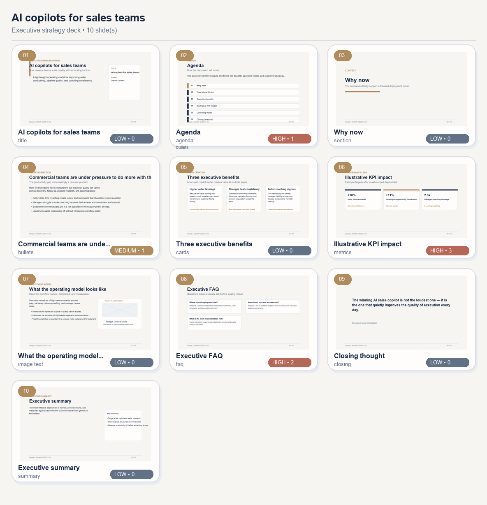
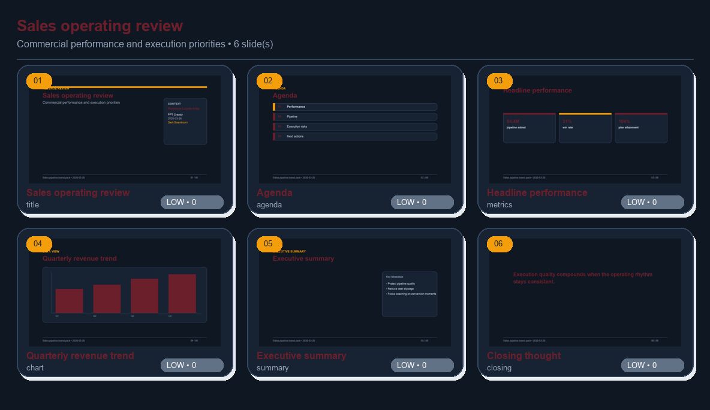
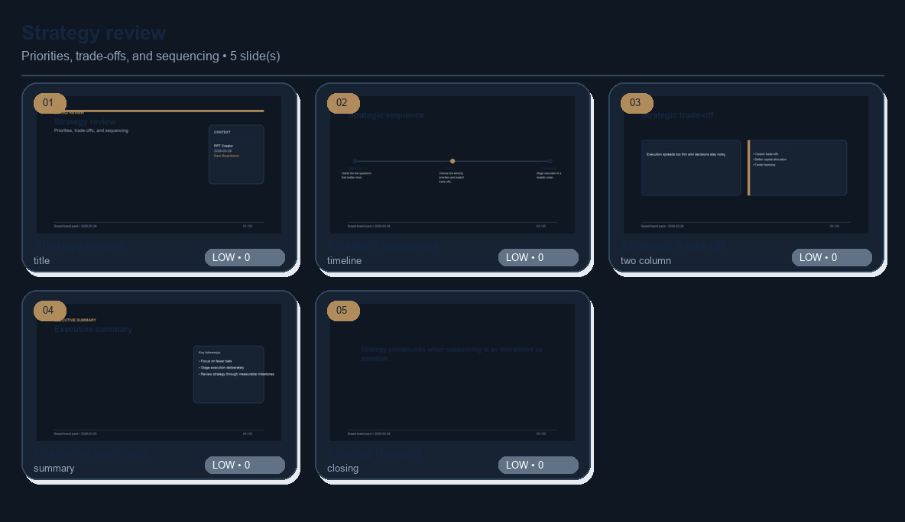
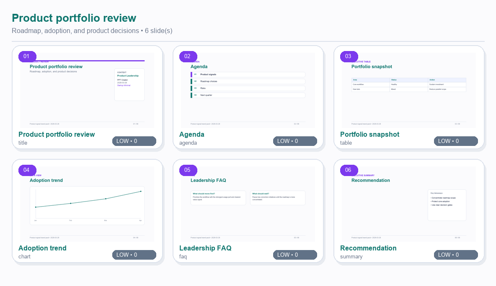
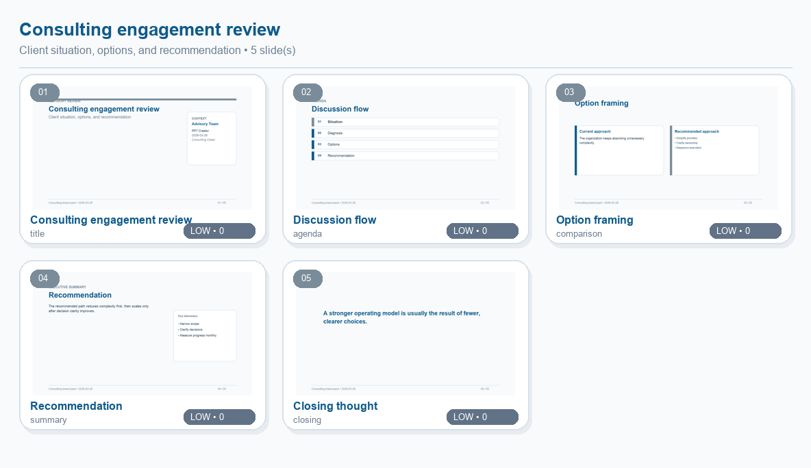
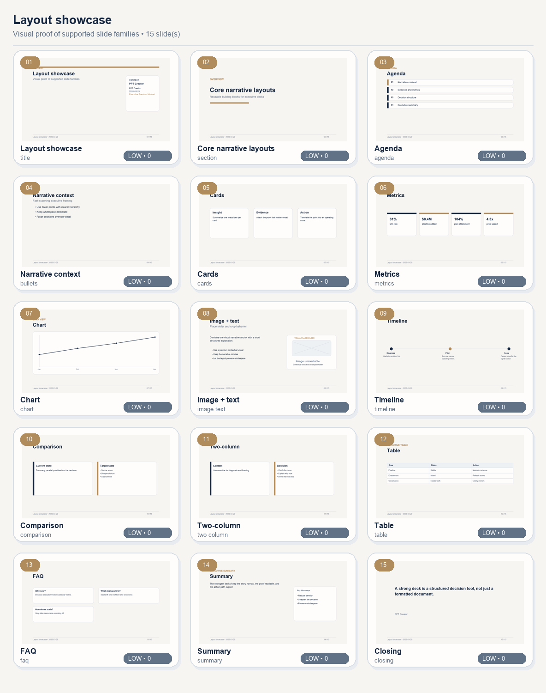

# PPT Creator

Gerador reutilizável de apresentações `.pptx` a partir de JSON estruturado, com foco em um visual **Executive Premium Minimal**.

> Este repositório agora representa o **app** `ppt_creator`: ele faz render/review/preview/validate e também pode atuar como **cliente HTTP** de um serviço local persistido de IA. O playground/runtime de modelos foi extraído para o diretório irmão `../hf_local_llm_service`.

---

## Objetivo

O componente `ppt_creator` foi criado para manter um pipeline simples e portátil:

1. JSON estruturado entra
2. um renderizador Python gera um `.pptx`
3. o layout segue um tema consistente e reutilizável

Sem depender de PowerPoint, LibreOffice, Ollama, MLX, llama.cpp ou Transformers.

---

## Arquitetura

```text
ppt_creator/
├── __init__.py
├── api.py
├── cli.py
├── renderer.py
├── schema.py
├── templates.py
├── theme.py
└── layouts/
    ├── __init__.py
    ├── bullets.py
    ├── chart.py
    ├── comparison.py
    ├── cards.py
    ├── closing.py
    ├── image_text.py
    ├── metrics.py
    ├── section.py
    ├── timeline.py
    └── title.py
```

Separação principal:

- `schema.py`: contratos do JSON de entrada com `pydantic`
- `theme.py`: style tokens e tema `Executive Premium Minimal`
- `renderer.py`: renderizador central e utilitários comuns
- `layouts/`: implementação isolada por tipo de slide
- `cli.py`: interface de linha de comando

### Escopo do subprojeto

O `ppt_creator` é um componente **independente** dentro deste repositório.

Isso significa que:

- ele não depende de `transformers`
- ele não depende de Ollama, MLX ou llama.cpp
- ele não depende de nenhum modelo específico, incluindo PPTAgent
- o coração dele continua sendo: **JSON estruturado -> `.pptx`**

Os fluxos de qualidade da Fase 2 passaram a focar no escopo do subprojeto:

- `ppt_creator/`
- `tests/`

Existe agora também uma camada **opcional e separada** em `ppt_creator_ai/`, usada para transformar um briefing estruturado em JSON de apresentação. No app, essa camada ficou reduzida a:

- `heuristic` para geração local sem LLM real
- `local_service` para delegar a geração ao serviço persistido `hf_local_llm_service`

Ela não interfere no núcleo do renderizador.

Além do tema base, o projeto agora também expõe temas prontos adicionais:

- `executive_premium_minimal`
- `consulting_clean`
- `dark_boardroom`
- `startup_minimal`

---

## Tipos de slide suportados

- `title`
- `section`
- `agenda`
- `bullets`
- `cards`
- `metrics`
- `chart`
- `image_text`
- `timeline`
- `comparison`
- `two_column`
- `table`
- `faq`
- `summary`
- `closing`

Todos suportam `speaker_notes`.

### Variantes de layout já suportadas

- `bullets`
  - `insight_panel` (padrão)
  - `full_width`
- `metrics`
  - `standard` (padrão)
  - `compact`
- `image_text`
  - `image_right` (padrão)
  - `image_left`
- `title`
  - `split_panel` (padrão)
  - `hero_cover`

Novos tipos executivos adicionados:

- `timeline`
  - sequência visual de 2 a 5 etapas
- `chart`
  - gráfico simples gerado por dados estruturados
- `comparison`
  - comparação lado a lado entre dois estados, opções ou estratégias
- `two_column`
  - narrativa em duas colunas para expor duas frentes ou perspectivas
- `table`
  - tabela executiva com colunas e linhas estruturadas
- `faq`
  - perguntas frequentes / appendix leve para objeções comuns
- `agenda`
  - sequência de tópicos para orientar a discussão
- `summary`
  - síntese executiva com mensagem principal e key takeaways

---

## Tema visual: Executive Premium Minimal

Direção implementada:

- base clara / off-white
- azul-marinho profundo como cor principal
- cinzas suaves para suporte
- destaque discreto em bronze sóbrio
- muito espaço em branco
- alinhamento rígido
- cards limpos com bordas leves
- sem excesso de shapes ou cores

O tema foi estruturado com tokens para facilitar futuros temas adicionais.

Hoje o tema já separa tokens em grupos para:

- canvas
- typography
- spacing
- grid
- colors
- components

---

## Formato do JSON

Estrutura de alto nível:

```json
{
  "presentation": {
    "title": "AI copilots for sales teams",
    "subtitle": "Executive strategy deck",
    "client_name": "Acme Corp",
    "author": "Your Name",
    "date": "2026-03-22",
    "theme": "executive_premium_minimal",
    "footer_text": "Acme Corp • Executive Review",
    "primary_color": "14263F",
    "secondary_color": "B08B5B"
  },
  "slides": [
    {
      "type": "title",
      "title": "AI copilots for sales teams",
      "subtitle": "How revenue teams scale quality without scaling friction",
      "speaker_notes": "Opening framing"
    }
  ]
}
```

Exemplo completo: `examples/ai_sales.json`

Exemplo de variante:

```json
{
  "type": "image_text",
  "title": "Operating model",
  "body": "Structured deployment model.",
  "layout_variant": "image_left"
}
```

Você também pode orientar melhor o crop da imagem em slides com mídia usando um focal point simples:

```json
{
  "type": "image_text",
  "title": "Operating model",
  "body": "Structured deployment model.",
  "image_path": "assets/operating_model.jpg",
  "image_focal_x": 0.2,
  "image_focal_y": 0.5
}
```

Esses campos ajudam o render e o preview a manterem áreas mais relevantes da imagem quando o encaixe precisa fazer crop em modo cover-fit.

Além do `image_text`, o projeto agora também começou a reutilizar esse pipeline de crop/focal point em **covers do tipo `title` com `hero_cover`**, permitindo usar imagem de apoio no bloco visual lateral da capa.

Exemplo de `timeline`:

```json
{
  "type": "timeline",
  "title": "90-day rollout",
  "timeline_items": [
    {"title": "Diagnose", "body": "Identify the highest-value workflow"},
    {"title": "Pilot", "body": "Launch a constrained rollout"},
    {"title": "Scale", "body": "Operationalize the successful pattern"}
  ]
}
```

Exemplo de `chart`:

```json
{
  "type": "chart",
  "title": "Revenue trend",
  "layout_variant": "column",
  "chart_categories": ["Q1", "Q2", "Q3", "Q4"],
  "chart_series": [
    {"name": "Revenue", "values": [10.8, 11.9, 13.1, 14.2]}
  ]
}
```

Exemplo de `comparison`:

```json
{
  "type": "comparison",
  "title": "Before vs after",
  "comparison_columns": [
    {"title": "Before", "bullets": ["Manual prep", "Uneven quality"]},
    {"title": "After", "bullets": ["Structured workflow", "Consistent quality"]}
  ]
}
```

Campos adicionais de branding disponíveis em `presentation`:

- `client_name`
- `footer_text`
- `logo_path`
- `primary_color`
- `secondary_color`

`primary_color` e `secondary_color` aceitam hex de 6 dígitos e permitem adaptar o tema sem criar um tema novo do zero.

---

## Instalação local

Se quiser usar o ambiente local do playground:

```bash
./.conda-env/bin/python -m pip install -e .
./.conda-env/bin/python -m pip install -e ".[dev]"
```

Ou com o Python ativo no seu shell:

```bash
python -m pip install -e .
python -m pip install -e ".[dev]"
```

### VS Code / Pylance

Se o VS Code mostrar avisos como `Import could not be resolved` para `pytest` ou `pptx`, normalmente o problema é o interpretador Python errado no workspace.

Este repositório agora inclui `.vscode/settings.json` apontando para o ambiente local do projeto:

```text
.conda-env/bin/python
```

Se os avisos continuarem:

1. abra o Command Palette
2. rode `Python: Select Interpreter`
3. escolha `${workspaceFolder}/.conda-env/bin/python`
4. rode `Developer: Reload Window`

Isso costuma resolver os warnings do Pylance sem mudar o código.

---

## Como rodar localmente

Renderizar um deck:

```bash
python -m ppt_creator.cli render examples/ai_sales.json outputs/ai_sales.pptx
```

Forçar outro tema pronto:

```bash
python -m ppt_creator.cli render examples/product_strategy.json outputs/product_strategy.pptx \
  --theme consulting_clean
```

Aplicar override de branding por cor:

```bash
python -m ppt_creator.cli render examples/ai_sales.json outputs/ai_sales_branded.pptx \
  --primary-color 112233 --secondary-color AABBCC
```

Ou usando o helper:

```bash
bash bin/render_ppt_creator.sh examples/ai_sales.json outputs/ai_sales.pptx
```

Dry run com relatório:

```bash
python -m ppt_creator.cli render examples/ai_sales.json outputs/ai_sales.pptx \
  --dry-run --report-json outputs/ai_sales_report.json --check-assets
```

Se quiser já embutir uma revisão heurística de qualidade no relatório do render:

```bash
python -m ppt_creator.cli render examples/ai_sales.json outputs/ai_sales.pptx \
  --dry-run --review --report-json outputs/ai_sales_report.json
```

Esse relatório agora pode incluir:

- `severity_counts`
- `overflow_risk_count`
- `collision_risk_count`
- `balance_warning_count`
- análise por slide

Você também pode pedir que o comando de render já gere previews no mesmo fluxo. Quando há runtime Office disponível, ele passa a preferir o preview do **`.pptx` final renderizado**:

```bash
python -m ppt_creator.cli render examples/ai_sales.json outputs/ai_sales.pptx \
  --preview-dir outputs/ai_sales_render_previews \
  --preview-report-json outputs/ai_sales_render_preview_report.json
```

Rodar uma revisão heurística de qualidade:

```bash
python -m ppt_creator.cli review examples/ai_sales.json --report-json outputs/ai_sales_review.json
```

Esse comando gera um relatório com:

- score médio do deck
- issues por slide
- alertas de densidade, bullet overload, tabelas carregadas e assets ausentes

Se quiser, o fluxo de review agora também pode gerar previews no mesmo passo e **preferir o `.pptx` renderizado** quando isso fizer sentido para o backend:

```bash
python -m ppt_creator.cli review examples/ai_sales.json \
  --preview-dir outputs/ai_sales_review_previews \
  --report-json outputs/ai_sales_review_with_preview.json
```

Renderização em lote:

```bash
python -m ppt_creator.cli render-batch examples outputs/batch \
  --pattern "*.json" --report-json outputs/batch_report.json
```

Gerar um template inicial por domínio:

```bash
python -m ppt_creator.cli template sales outputs/sales_template.json
```

Você também pode adaptar o starter deck por **perfil de público**:

```bash
python -m ppt_creator.cli template sales outputs/board_sales_template.json \
  --audience-profile board
```

Domínios disponíveis:

- `sales`
- `consulting`
- `strategy`
- `product`

Perfis de público disponíveis:

- `board`
- `consulting`
- `sales`
- `product`

Também já existe uma primeira **biblioteca de collections de assets** e perfis consultáveis pela CLI:

```bash
python -m ppt_creator.cli profiles
python -m ppt_creator.cli brand-packs
python -m ppt_creator.cli assets
```

Os **brand packs** ajudam a productizar melhor o uso recorrente do app, combinando:

- tema default
- footer/client naming
- cores primária/secundária
- cover eyebrow/layout preference
- coleções de assets recomendadas

Aplicar um brand pack a um starter template:

```bash
python -m ppt_creator.cli template sales outputs/sales_board_template.json \
  --brand-pack board_navy
```

Agora também existe uma biblioteca inicial de **workflows operacionais/comerciais** para bootstrap mais rápido de decks recorrentes:

```bash
python -m ppt_creator.cli workflows
python -m ppt_creator.cli workflow-template sales_qbr outputs/sales_qbr_template.json
```

Esses workflows combinam:

- domínio base do starter template
- perfil de público recomendado
- brand pack default quando fizer sentido
- coleções de assets sugeridas
- backend de preview preferido
- caminhos padrão para `.pptx`, previews e reports

Os packets de workflow agora também carregam uma **recomendação operacional explícita de preview/regressão**, incluindo:

- backend sugerido
- se o fluxo deve exigir preview real (`rendered_pptx`) por padrão
- diretório baseline recomendado
- sequência crítica sugerida (`render -> preview-pptx -> compare/review-pptx -> promote-baseline`)
- guidance de provenance para evitar diffs ambíguos

Também existe agora um **template packet** para fluxos de bootstrap por domínio, com:

- `asset_collections` recomendadas por domínio/brand pack
- `slide_asset_suggestions` por slide/tipo narrativo
- sugestão inicial de `visual_type` (`photo`, `screenshot`, `diagram`, `analytical_visual`)

Você também pode sobrescrever o brand pack do workflow no bootstrap:

```bash
python -m ppt_creator.cli workflow-template sales_qbr outputs/sales_qbr_template.json \
  --brand-pack sales_pipeline
```

Gerar JSON inicial a partir de um briefing estruturado:

```bash
python -m ppt_creator_ai.cli generate examples/briefing_sales.json outputs/briefing_sales_deck.json
```

Esse fluxo pertence à camada opcional `ppt_creator_ai/` e foi mantido separado do renderizador principal.

### Providers disponíveis no app

Hoje o app expõe apenas dois providers:

- `heuristic` → geração local sem LLM real, útil para desenvolvimento e fallback
- `local_service` → cliente HTTP fino que chama o serviço persistido `hf_local_llm_service`

Listar providers:

```bash
python -m ppt_creator_ai.cli providers
```

Usar explicitamente o provider heurístico:

```bash
python -m ppt_creator_ai.cli generate examples/briefing_sales.json outputs/briefing_sales_deck.json \
  --provider heuristic
```

Usar o serviço local persistido:

```bash
export PPT_CREATOR_AI_SERVICE_URL=http://127.0.0.1:8788
export PPT_CREATOR_AI_SERVICE_PROVIDER=ollama
export PPT_CREATOR_AI_SERVICE_MODEL=nemotron-3-nano:30b-cloud
export PPT_CREATOR_AI_SERVICE_TIMEOUT_SECONDS=180

python -m ppt_creator_ai.cli generate examples/briefing_sales.json outputs/briefing_sales_deck.json \
  --provider local_service
```

Esse provider envia o briefing para o diretório irmão `../hf_local_llm_service`, que é o componente persistido responsável por:

- hospedar modelos locais
- manter `.hf/`, `models/` e runtimes
- responder inferência genérica por `POST /v1/generate`

O app agora envia para esse serviço um prompt estruturado + **generation contract** explícito, recebe texto/JSON bruto e faz o parsing/validação do deck no próprio app.

Esse contract inclui:

- tipos de slide suportados
- variantes de layout conhecidas
- regras de densidade executiva
- exigência de `JSON-only` com `type` por slide

Na prática isso reduz bastante o risco de o LLM devolver JSON incompleto ou fora do schema.

Em teste direto contra o Ollama local com `nemotron-3-nano:30b-cloud`, a resposta crua em JSON tende a ainda omitir campos como `type` em slides. O caminho mais robusto agora é: **Ollama externo + `hf_local_llm_service` via `/v1/generate` + generation contract + validação Pydantic no app**.

Também existe agora um benchmark automatizado para testar diversidade e robustez do fluxo prompt->deck:

```bash
python -m ppt_creator_ai.cli benchmark outputs/ai_benchmark \
  --provider local_service \
  --write-json-decks \
  --report-json outputs/ai_benchmark/report.json
```

Isso é útil especialmente para validar o comportamento do modelo `nemotron-3-nano:30b-cloud` sem acoplar Ollama dentro do app.

### Fluxo integrado de geração + review + render

```bash
python -m ppt_creator_ai.cli generate examples/briefing_sales.json outputs/briefing_sales_deck.json \
  --review-json outputs/briefing_sales_review.json \
  --render-pptx outputs/briefing_sales_deck.pptx
```

Também existe uma camada de **refinamento automático heurístico**:

```bash
python -m ppt_creator_ai.cli generate examples/briefing_sales.json outputs/briefing_sales_deck.json \
  --auto-refine --refine-passes 2 --report-json outputs/briefing_sales_generation_report.json
```

E uma camada de **regeneração automática baseada em feedback do review**:

```bash
python -m ppt_creator_ai.cli generate examples/briefing_sales.json outputs/briefing_sales_deck.json \
  --auto-regenerate --regenerate-passes 2 --report-json outputs/briefing_sales_regeneration_report.json
```

Quando você também pede `--preview-dir`, o pipeline incorpora sinais visuais vindos do preview. Se o mesmo comando usa `--render-pptx`, ele passa a preferir o preview do `.pptx` final renderizado quando isso fizer sentido para o backend.

Exemplo com preview visual:

```bash
python -m ppt_creator_ai.cli generate examples/briefing_sales.json outputs/briefing_sales_deck.json \
  --preview-dir outputs/briefing_sales_previews \
  --preview-report-json outputs/briefing_sales_preview_report.json
```

E, se você quiser preview a partir do `.pptx` final:

```bash
python -m ppt_creator_ai.cli generate examples/briefing_sales.json outputs/briefing_sales_deck.json \
  --render-pptx outputs/briefing_sales_deck.pptx \
  --preview-dir outputs/briefing_sales_real_previews \
  --preview-from-rendered-pptx
```

Gerar previews PNG por slide e uma folha de thumbnails:

```bash
python -m ppt_creator.cli preview examples/ai_sales.json outputs/previews \
  --basename ai-sales-preview
```

Esse comando gera:

- um `.png` por slide
- uma folha `*-thumbnails.png` com miniaturas do deck
- um relatório heurístico de qualidade dentro do `--report-json`, quando usado

Você também pode ativar overlays de debug para inspecionar alinhamento e áreas seguras:

```bash
python -m ppt_creator.cli preview examples/ai_sales.json outputs/previews \
  --basename ai-sales-preview --debug-grid --debug-safe-areas
```

Isso ajuda a diagnosticar:

- safe areas
- header/body anchors
- linhas-guia de composição

Também existe agora uma seleção explícita de backend de preview:

```bash
python -m ppt_creator.cli preview examples/ai_sales.json outputs/previews \
  --backend auto
```

Opções disponíveis:

- `auto` → tenta usar backend Office quando disponível, com fallback para o sintético
- `synthetic` → força o preview em Pillow
- `office` → exige runtime compatível (`soffice`/`libreoffice`) para tentar previews mais fiéis ao `.pptx`

Hoje, se o runtime de Office não estiver instalado, o sistema cai automaticamente no backend sintético quando você usa `auto`.

A folha de thumbnails também começou a incorporar sinais do review heurístico, destacando slides mais arriscados com badges de risco e regiões prováveis de overflow.

Também entrou uma primeira camada de **regressão visual baseada em golden previews**:

```bash
python -m ppt_creator.cli preview examples/ai_sales.json outputs/previews \
  --baseline-dir outputs/golden-previews --write-diff-images
```

Isso permite comparar os previews atuais contra um diretório baseline, gerar scores de diferença por slide e opcionalmente salvar imagens de diff para inspeção.

Se você quiser transformar isso em um gate operacional, agora também existe um modo explícito para **falhar quando houver regressão**:

```bash
python -m ppt_creator.cli preview examples/ai_sales.json outputs/previews \
  --baseline-dir outputs/golden-previews --fail-on-regression
```

O relatório de regressão agora também passou a destacar:

- `added_slide_numbers`
- `removed_slide_numbers`
- `top_regressions`
- `guidance`

Isso ajuda a entender mais rapidamente se o problema foi:

- diferença visual real
- mudança no número de slides
- baseline desatualizado
- mismatch de provenance entre preview atual e baseline

Também já existe um comando explícito para **promover um conjunto de previews para baseline**:

```bash
python -m ppt_creator.cli promote-baseline outputs/previews outputs/golden-previews
```

Por padrão ele limpa o baseline anterior e copia:

- os PNGs de preview
- a thumbnail sheet
- o `preview-manifest.json`

Também já existe um caminho explícito para gerar preview a partir de um **`.pptx` real**:

```bash
python -m ppt_creator.cli preview-pptx outputs/ai_sales.pptx outputs/ai_sales_real_previews
```

Esse fluxo ajuda a aproximar ainda mais a inspeção visual do artefato final gerado.

Quando o LibreOffice exporta apenas um PNG único na conversão direta do `.pptx`, o projeto agora tenta automaticamente um caminho mais robusto:

- `.pptx` -> `.pdf` via LibreOffice
- `.pdf` -> um PNG por página via Ghostscript (`gs`)

Isso melhora bastante a confiabilidade do preview real em ambientes onde a exportação direta para PNG não sai slide a slide.

Agora também existe um fluxo explícito de **review QA diretamente sobre um `.pptx` já renderizado**:

```bash
python -m ppt_creator.cli review-pptx outputs/ai_sales.pptx outputs/ai_sales_review_pptx \
  --report-json outputs/ai_sales_review_pptx_report.json
```

Esse caminho ajuda quando você quer validar o artefato final em si, não apenas o spec JSON original.

Também já existe um fluxo explícito para **comparar visualmente duas versões `.pptx`** usando previews reais do artefato final:

```bash
python -m ppt_creator.cli compare-pptx outputs/v1.pptx outputs/v2.pptx outputs/compare_v1_v2 \
  --write-diff-images --report-json outputs/compare_v1_v2_report.json
```

Isso ajuda a transformar a regressão visual em algo mais operacional quando você quer comparar duas versões renderizadas do deck, não só um baseline manual de PNGs.

Se quiser usar esse fluxo como verificação obrigatória:

```bash
python -m ppt_creator.cli compare-pptx outputs/v1.pptx outputs/v2.pptx outputs/compare_v1_v2 \
  --fail-on-regression
```

### Fluxo recomendado para regressão crítica e baseline management

Este agora deve ser tratado como o **caminho padrão recomendado** para checks críticos de qualidade visual e sign-off:

Para checks mais confiáveis, a ordem recomendada agora é:

1. renderizar o `.pptx` final
2. gerar preview real com `preview-pptx` quando possível
3. comparar versões renderizadas com `compare-pptx`
4. revisar `guidance`, `top_regressions`, `added_slide_numbers` e `removed_slide_numbers`
5. só então promover o conjunto aprovado com `promote-baseline`

Exemplo completo:

```bash
python -m ppt_creator.cli render examples/ai_sales.json outputs/ai_sales.pptx
python -m ppt_creator.cli preview-pptx outputs/ai_sales.pptx outputs/ai_sales_real_previews
python -m ppt_creator.cli compare-pptx outputs/baseline.pptx outputs/ai_sales.pptx outputs/compare_ai_sales \
  --write-diff-images --report-json outputs/compare_ai_sales_report.json
python -m ppt_creator.cli promote-baseline outputs/ai_sales_real_previews outputs/golden-previews
```

Esse fluxo preserva melhor a provenance do preview e reduz ambiguidades na hora de depurar diferenças reais vs. baselines desatualizados.

## Modo API / serviço

Também existe um modo HTTP simples para integrar o `ppt_creator` em outros fluxos:

```bash
python -m ppt_creator.api --host 127.0.0.1 --port 8787 --asset-root examples
```

Endpoints disponíveis:

- `GET /health`
- `GET /ai/providers`
- `GET /templates`
- `GET /brand-packs`
- `GET /profiles`
- `GET /assets`
- `GET /workflows`
- `GET /artifact`
- `POST /compare-pptx`
- `POST /generate`
- `POST /generate-and-render`
- `POST /review`
- `POST /preview`
- `POST /validate`
- `POST /render`
- `POST /template`
- `POST /workflow-template`

O endpoint `POST /render` também pode receber `include_review: true` para devolver a revisão heurística junto com o resultado do render/dry-run.

Os endpoints novos do app para geração funcionam assim:

- `POST /generate` → recebe um briefing, usa o provider configurado e devolve o JSON estruturado
- `POST /generate-and-render` → recebe um briefing, gera o JSON e já renderiza o `.pptx`

Isso permite que o app atue ao mesmo tempo como:

- **servidor stateless** para operações de deck
- **cliente HTTP** do serviço local persistido de IA

Também já existe um playground/editor local bem inicial servindo HTML em:

- `GET /playground`

Ele agora permite:

- colar/editar JSON diretamente
- carregar starter templates por domínio/perfil
- aplicar brand packs direto no bootstrap do template/workflow
- carregar workflows operacionais prontos
- persistir o estado local do playground no navegador
- escolher backend/baseline de preview
- exigir preview real e fail-on-regression direto da interface quando quiser transformar o review em gate operacional
- abrir artefatos gerados e thumbnail sheets direto da interface
- navegar por uma galeria simples dos previews gerados
- mostrar cards com guidance/top regressions/slide set changes quando existe regressão visual
- acionar validate/review/preview/render diretamente contra a API local
- editar rapidamente slides comuns via **guided editor** sem mexer no JSON bruto para tudo
- promover o preview atual para baseline direto da interface

O guided editor já ajuda em casos comuns como:

- `title` / `subtitle` / `eyebrow` / `body`
- `bullets`
- `metrics`
- `comparison` / `two_column`
- `table`
- `faq`
- `timeline`

Isso já cobre os casos mais comuns de um **editor visual leve**, sem substituir o JSON bruto.

## Documentação operacional rápida

- `docs/preview-provenance.md`
- `docs/visual-regression.md`
- `docs/compare-pptx.md`
- `docs/review-pptx.md`
- `docs/baseline-management.md`
- `docs/ai-layer.md`

## Galeria visual real

O repositório agora também consegue gerar automaticamente uma galeria visual real dos decks e layouts suportados:

```bash
make gallery
```

Miniaturas geradas:

### AI sales



### Sales QBR



### Board strategy review



### Product operating review



### Consulting steerco



### Layout showcase



## Auditoria automatizada de layouts

Para automatizar a revisão slide a slide dos layouts mais sensíveis, agora existe:

```bash
make layout-audit
```

Esse fluxo gera um report em:

- `docs/layout_audit/report.json`
- `docs/layout_audit/report.md`

Ele audita automaticamente pelo menos:

- `title`
- `metrics`
- `comparison`
- `two_column`
- `table`
- `faq`
- `summary`
- `closing`

## Release e distribuição

O projeto agora também inclui entrypoints instaláveis e um pipeline formal de distribuição.

Entry points:

- `ppt-creator`
- `ppt-creator-ai`

Comandos úteis:

```bash
make build-dist
make check-dist
make release-smoke
```

Também existe um workflow de release em `.github/workflows/release.yml` para build, validação, smoke test e publicação via tag `v*`.

Exemplo de validação por API:

```bash
curl -X POST http://127.0.0.1:8787/template \
  -H 'Content-Type: application/json' \
  -d '{"domain":"sales"}'
```

---

## Como rodar com Docker

Build:

```bash
docker build -t ppt-creator .
```

Run com bind mount do diretório atual:

```bash
docker run --rm -v "$PWD:/work" ppt-creator \
  python -m ppt_creator.cli render /work/examples/ai_sales.json /work/outputs/ai_sales.pptx
```

Ou com helper:

```bash
bash bin/render_ppt_creator_docker.sh examples/ai_sales.json outputs/ai_sales.pptx
```

O container do app continua **enxuto**: ele inclui apenas `ppt_creator` e `ppt_creator_ai`, mas não empacota Ollama nem o `hf_local_llm_service`.

---

## Como gerar o deck de exemplo

```bash
python -m ppt_creator.cli render examples/ai_sales.json outputs/ai_sales.pptx
```

Saída esperada:

- arquivo `.pptx` real em `outputs/ai_sales.pptx`
- deck com 10 slides
- notas do apresentador por slide

Exemplos adicionais disponíveis:

- `examples/product_strategy.json`
- `examples/board_review.json`
- `examples/sales_qbr.json`
- `examples/board_strategy_review.json`
- `examples/product_operating_review.json`
- `examples/consulting_steerco.json`
- `examples/layout_showcase.json`

Você também pode renderizar todos com:

```bash
make render-all-examples
```

Esses exemplos adicionais cobrem fluxos mais reais de:

- sales QBR
- board strategy review
- product operating review
- consulting steerco
- showcase visual de layouts suportados

---

## Testes

Executar testes rápidos:

```bash
pytest -q
```

Os testes cobrem:

- validação do schema
- renderização mínima de `.pptx`
- execução simples da CLI
- validação e renderização de todos os exemplos em `examples/`

---

## Productização e DX

O projeto agora também inclui:

- `CHANGELOG.md`
- `Makefile`
- workflow de CI em `.github/workflows/ci.yml`
- configuração de lint/format com Ruff no `pyproject.toml`

Importante: a lint/CI desta camada foi configurada para validar o **subprojeto de PPT**, e não todos os scripts legados do playground.

Comandos úteis:

```bash
make install-dev
make lint
make test
make validate-example
make render-example
make review-example
make review-pptx-example
make playground
make render-all-examples
```

---

## Reuso em outro projeto

Formas simples de reaproveitar:

1. copiar `ppt_creator/`, `pyproject.toml`, `Dockerfile` e `bin/`
2. instalar o pacote em outro diretório
3. montar JSONs compatíveis com o schema
4. gerar decks sem depender do restante do playground

Como o componente não está acoplado ao runtime de LLM, ele pode ser usado como etapa final de renderização em qualquer pipeline.

---

## Limitações atuais

- gráficos simples suportados, mas ainda sem visualização avançada/múltiplas configurações analíticas
- sem geração automática de conteúdo por LLM
- imagens são opcionais e não passam por tratamento avançado de crop/layout inteligente
- imagens ausentes usam um placeholder estruturado, mas ainda sem fallback visual avançado por tipo de conteúdo
- não usa templates `.potx` externos nesta primeira versão

---

## Próximos passos possíveis

- integração opcional com LLM para gerar JSON
- mais temas visuais e branding mais avançado
- gráficos e tabelas executivas
- sugestão automática de imagens
- suporte opcional a template externo premium

## Camada opcional de briefing estruturado

Exemplo de input opcional em `examples/briefing_sales.json`.

Também já existe um primeiro suporte a **briefing mais livre em texto**, mesmo sem todos os campos estruturados. Exemplo mínimo:

```json
{
  "title": "AI copilots for sales teams",
  "briefing_text": "Sales leaders are overloaded with repetitive preparation work. We should start with one workflow, measure time saved and quality lift, and only then expand scope."
}
```

Essa camada tenta:

- gerar um deck inicial a partir de briefing
- expandir um outline em agenda e narrativa básica
- montar slides estruturados de contexto, métricas, timeline, comparação, FAQ e summary
- resumir texto mais longo em bullets executivos
- sugerir direções de imagem / placeholder automaticamente
- sugerir direções de imagem também por tipo de slide, não só no nível geral do briefing
- sugerir também estilo visual do asset e hint inicial de focal point por slide
- revisar densidade do deck gerado para sinalizar slides potencialmente carregados

Ela **não depende de LLM** nesta fase: é um gerador heurístico, útil como ponto de partida para pipelines futuros.

Para preparar a futura entrada de LLM real, a camada opcional do app ficou com uma interface de provider enxuta. O runtime/model serving real foi extraído para o serviço persistido `hf_local_llm_service`, mantendo o núcleo do `ppt_creator` desacoplado da infraestrutura de modelos.

## Evolução visual e QA

O projeto agora também começou a ganhar uma primeira camada de QA visual heurística no pipeline de previews:

- thumbnail sheet mais legível e organizado
- identificação visual de slide número/título/tipo
- overlays de debug opcionais
- revisão heurística de densidade e risco visual no relatório de preview
- comando/endpoint dedicado de review heurístico para QA do deck

Também começou a entrar uma primeira camada de **auto-fit tipográfico** em caixas homogêneas mais críticas, especialmente para reduzir overflow em títulos, subtitles, narrative boxes e painéis executivos mais sensíveis.

Essa cobertura inicial agora já alcança também mais layouts executivos com maior chance de overflow, como:

- `agenda`
- `metrics`
- `faq`
- `table`
- `image_text`

Também começou a entrar uma base bem inicial de **layout primitives** dentro do renderizador, com utilitários para:

- calcular bounds internos de painéis de forma consistente
- distribuir regiões verticais dentro de painéis compostos
- distribuir regiões horizontais para rows/columns de forma reutilizável
- compor grids simples a partir dessas regiões para layouts multi-painel
- expor helpers mais semânticos para `columns`, `rows`, `panel rows` e `panel grids`
- usar pesos de conteúdo para começar a balancear larguras e alturas automaticamente
- começar a aplicar stacks verticais guiadas por conteúdo em regiões textuais mais densas
- expandir esse balanceamento para layouts de agenda, bullets e closing com mais regiões semânticas

Essa base já começou a ser aplicada em layouts compostos mais exigentes, como:

- `comparison`
- `faq`
- `cards`
- `two_column`
- `metrics`
- `table`
- `summary`

Além disso, alguns layouts já começaram a ganhar um primeiro balanceamento automático baseado em densidade de conteúdo, especialmente em colunas/rows como `metrics`, `cards`, `table`, `comparison`, `two_column`, `faq` e `summary`.

Layouts narrativos com mistura de corpo + bullets, como `comparison`, `two_column` e `image_text`, também começaram a usar stacks verticais reequilibradas por peso de conteúdo para reduzir divisão rígida de espaço.

Essa mesma abordagem começou a se espalhar também para outros layouts executivos, como `agenda`, `bullets` e `closing`, que agora usam divisões mais semânticas e menos rígidas para texto, painéis e blocos auxiliares.

O rollout também já começou a alcançar layouts que ainda estavam mais rígidos, como `title`, `section`, `chart` e `timeline`, especialmente com splits ponderados, stacks internas mais semânticas e cobertura adicional de auto-fit em blocos sensíveis.

Mais recentemente entrou também uma camada de **constraints semânticas explícitas** no motor de layout, com suporte a colunas/rows que misturam:

- regiões fixas (por exemplo sidebars e markers)
- regiões flexíveis guiadas por `target_share`
- limites máximos como `max_width` e `max_height`

Isso já começou a ser usado para estabilizar melhor capas, slides de seção, charts com bloco narrativo e timelines com painéis mais previsíveis.

Essa mesma linha agora também avançou mais em layouts compostos como `metrics`, `comparison`, `faq` e `summary`, onde painéis, grids e regiões internas passaram a usar combinações mais explícitas de colunas/rows constrained, max bounds e distribuição guiada por peso de conteúdo.

Isso ainda não é um layout engine completo, mas já é o primeiro passo para sair de coordenadas excessivamente rígidas e caminhar para composição mais resiliente.

Também já existe uma primeira infraestrutura para um backend de preview mais fiel ao `.pptx` quando um runtime de Office estiver disponível localmente, mantendo fallback limpo para o preview sintético.

Na camada de review heurístico, o projeto também começou a ganhar sinais mais fortes de **risco visual**, incluindo:

- contagem por severidade (`high` / `medium` / `low`)
- sinais agregados de risco de overflow
- sinais agregados de desbalanceamento entre painéis/colunas

Esses sinais ainda são heurísticos, mas ajudam a transformar o review em algo mais próximo de um QA de composição, não só de validação estrutural.

Os relatórios também passam a destacar melhor onde olhar primeiro, com campos como:

- `clipping_risk_count`
- `collision_risk_count`
- `top_risk_slides`
- `likely_overflow_regions` por slide

Quando o fluxo de review também gera preview, esses sinais agora podem ser enriquecidos por indícios do **preview final**, como crowding perto do footer, intrusão em safe areas e empacotamento agressivo nas bordas/cantos.

O próximo passo mais importante continua sendo evoluir de preview sintético para preview fiel ao `.pptx` real.

Também entrou uma primeira camada de análise de artefatos no próprio preview, com sinais como contato com bordas e densidade suspeita nas margens do slide.

Essa análise agora também começou a observar melhor o **corpo útil do slide** acima do footer, adicionando sinais como:

- contato do conteúdo principal com bordas antes da região de footer
- intrusão em safe areas
- aproximação excessiva da linha de footer
- densidade suspeita em cantos críticos

Também começou a entrar uma primeira camada de **crop/cover-fit mais inteligente** para imagens encaixadas em caixas fixas, especialmente no layout `image_text` e no preview correspondente, reduzindo distorção e melhorando o aproveitamento visual da área de imagem.

Os placeholders de imagem também começaram a ganhar uma apresentação mais premium/estruturada, deixando mais claro quando um slide ainda espera um asset real sem parecer apenas um bloco vazio.

Na camada opcional `ppt_creator_ai`, já existe agora uma **primeira etapa de revisão iterativa via provider** depois do QA heurístico. Em outras palavras: além de regenerar ou refinar heuristicamente, o pipeline já pode pedir a um provider real que **reescreva o deck gerado à luz do review e das críticas por slide**, retornando um novo JSON estruturado.

No lado mais operacional/comercial, o projeto também começou a ganhar uma camada explícita de **workflow presets** para casos recorrentes de uso, como QBR de vendas, board strategy review, product operating review e steerco de consultoria. Isso ajuda a aproximar o `ppt_creator` de fluxos reais de operação, não só de exemplos genéricos.

Também já existe um caminho opcional para pedir ao provider uma **crítica slide a slide combinando briefing + QA** e salvar isso em JSON:

```bash
python -m ppt_creator_ai.cli generate examples/briefing_sales.json outputs/briefing_sales_deck.json \
  --provider local_service \
  --llm-critique-json outputs/briefing_sales_llm_critiques.json
```

Isso ajuda a aproximar ainda mais o ciclo de:

- briefing
- deck gerado
- QA heurístico
- crítica estruturada por slide
- revisão iterativa opcional com provider real
